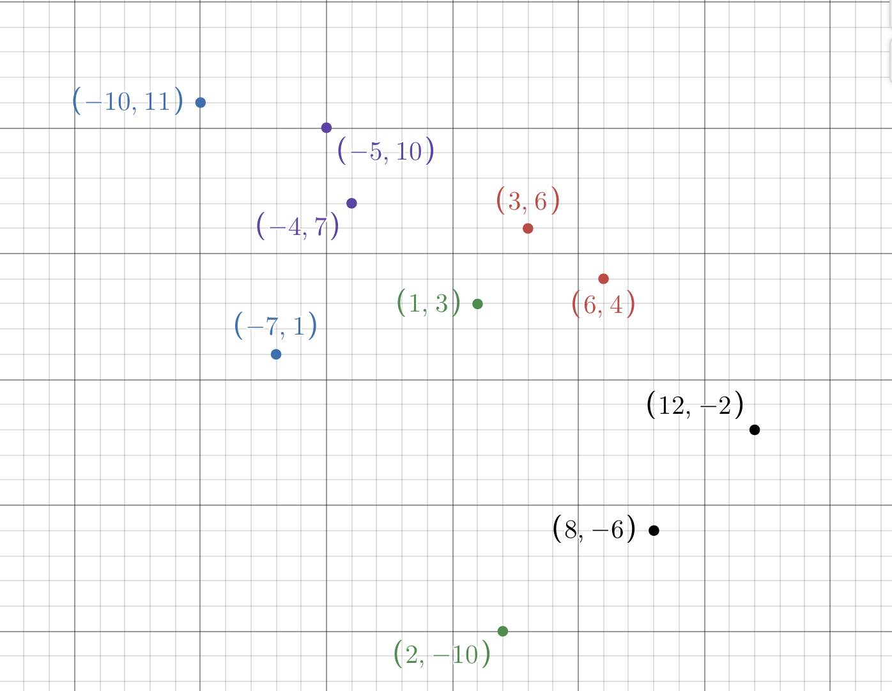

## isClean() tests
For `d = -1`
- `(6,4)` to `(12,-2)` and `d = -1` should be True
- `(1,3)` to `(12,-2)` and `d = -1` should be False
- `(6,4)` to `(8,-6)` and `d = -1` should be False
- `(1,3)` to `(8,-6)` and `d = -1` should be True

For `d = 1`
- `(2,-10)` to `(6,4)` and `d = 1` should be True
- `(-4,7)` to `(6,4)` and `d = 1` should be False
- `(3,6)` to `(6,4)`  and `d = 1` should be False
- `(1,3)` to `(6,4)`  and `d = 1` should be True

## sweep() tests
- `(-4,7)` to `(6,4)` and `d = 1` should be `(3,6)`
- `(3,6)` to `(6,4)`  and `d = 1` should be `(6,4)`
- `(1,3)` to `(12,-2)` and `d = -1` should be `(3,6)`
- `(6,4)` to `(8,-6)` and `d = -1` should be `(1,3)`

## Sweep/Greedy Routing Tests

### Path 1: (-10, 11) to (6,4)

Sweep/Greedy Result should be `(-10,11), (-5,10), (4,7), (3,6), (6,4)`

### Path 2: (-10, 11) to (12,-2)

