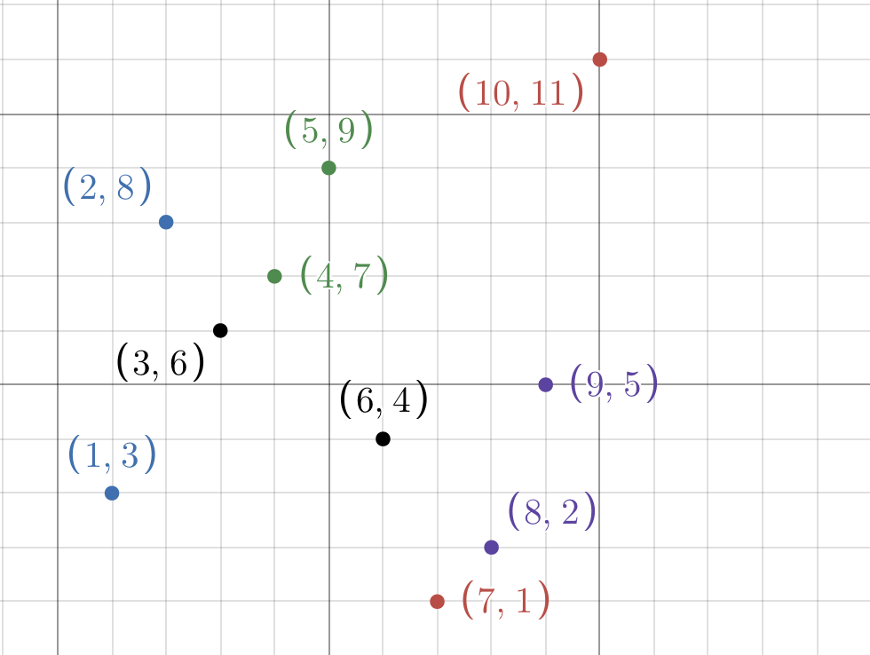
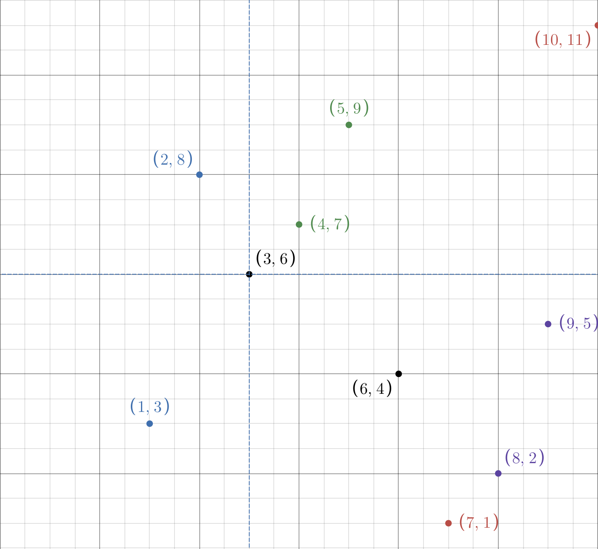
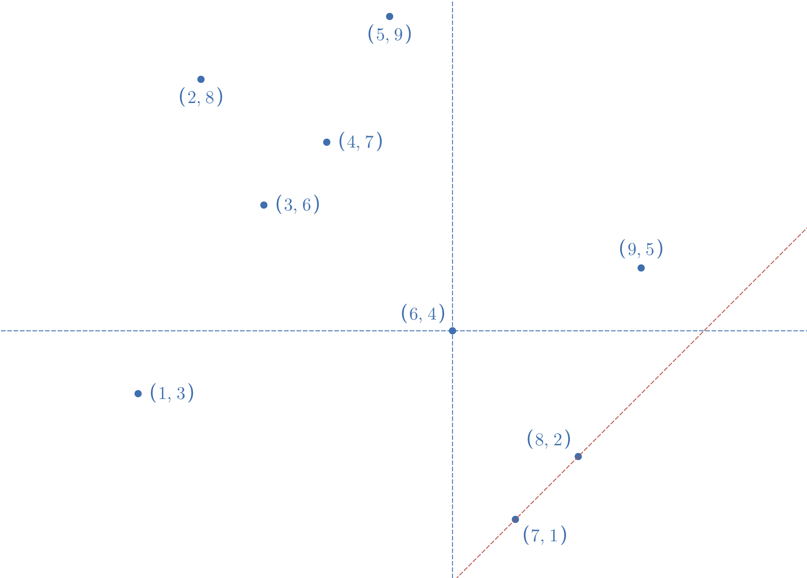
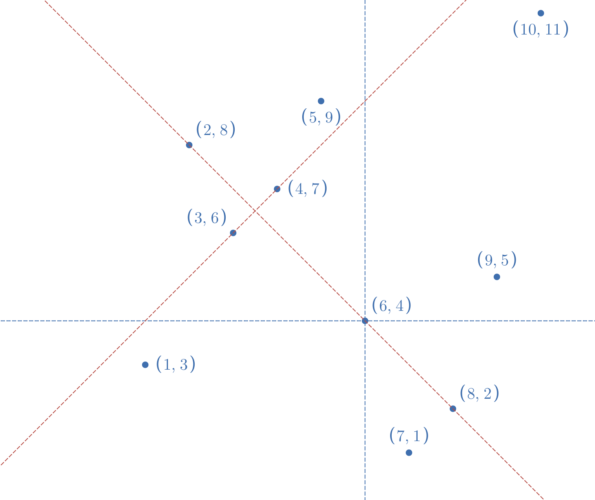

# Test graph 1: 
List of points: 
- (1, 3)
- (4, 7)
- (8, 2)
- (3, 6)
- (7, 1)
- (2, 8)
- (5, 9)
- (9, 5)
- (6, 4)
- (10, 11)

Graph visulazation:

## Test case 1 - Neighbor Test for p(3,6): 

`ThetaFourVertex v1 = ThetaFourVertex(3,6);`

`setNeighborFor(v1)` should set vertices to `[(1,3), (4,7), (2,8), (6,4)]`

## Test case 2 - Neighbor Test for p(6,4): 

### Cone 0: `(8,2)`
### Cone 1: `(9,5)`

`ThetaFourVertex v2 = ThetaFourVertex(6,4);`

NOTE: (8,2) is chosen for being the closest one to 6,4. 

### Cone 2: either `(3,6)` or `(4,7)`

`ThetaFourVertex v2 = ThetaFourVertex(6,4);`

### Cone 3: `(1,3)`

## Test case 3 - Neighbor Test for p(4,7): 
`setNeighborFor(v1)` should set neighbor vertices to `[(6,4), (5,9), (2,8), (3,6)]`

Sure, here are the vertices with both negative and positive values formatted as requested:

(1, 3)
(-4, 7)
(8, -2)
(3, 6)
(-7, 1)
(2, -8)
(-5, 9)
(9, -5)
(6, 4)
(-10, 11)